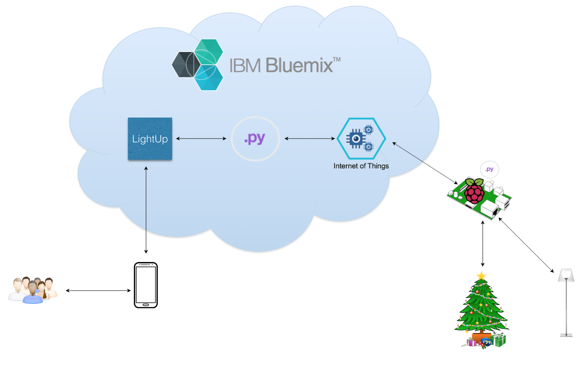
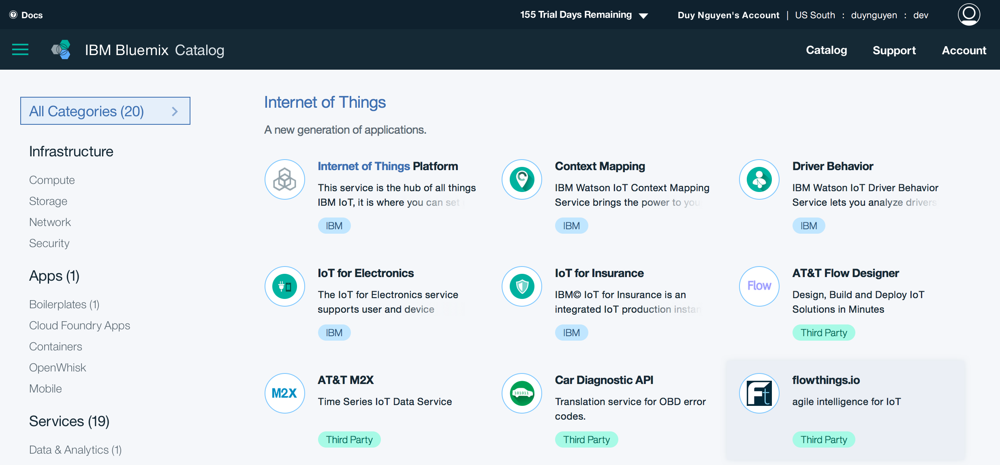
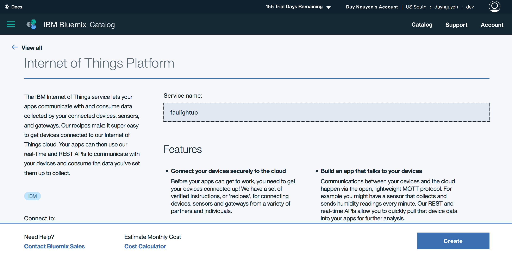
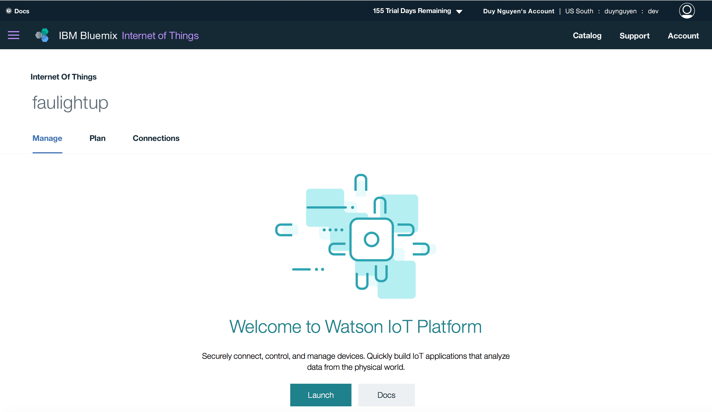
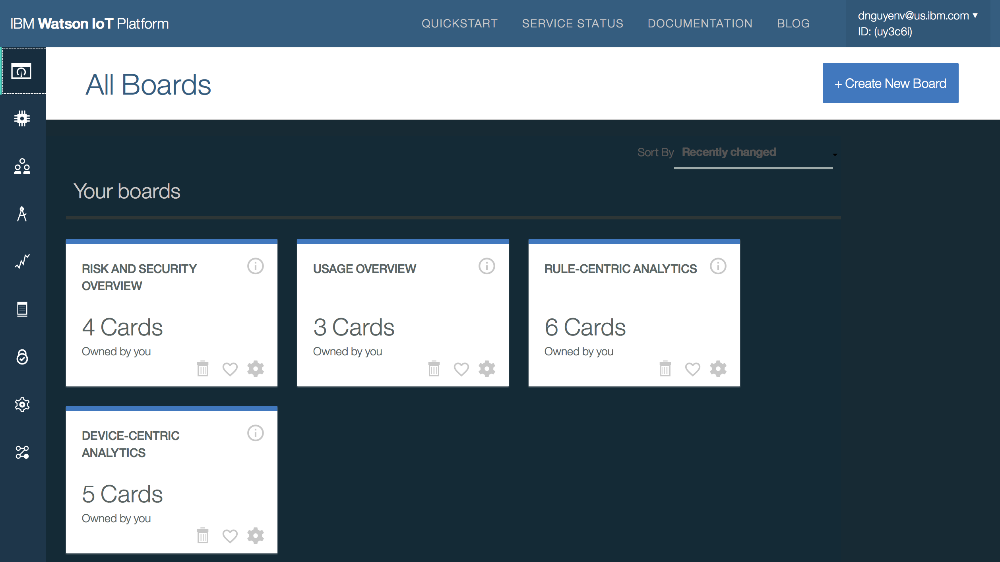
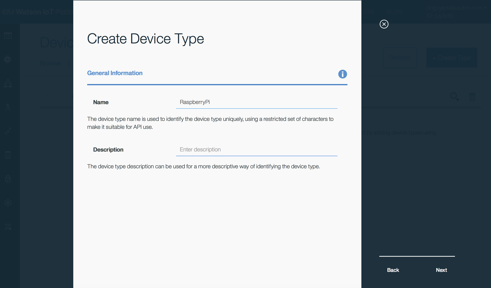
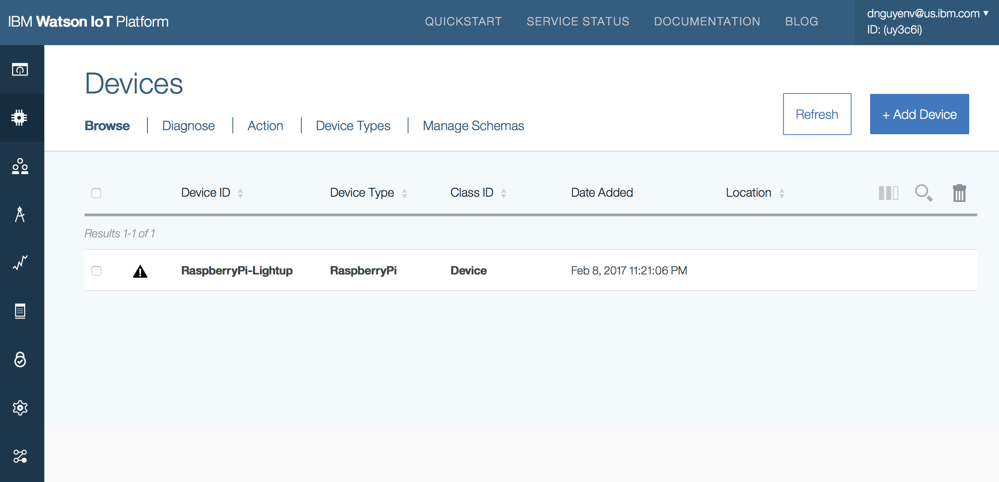
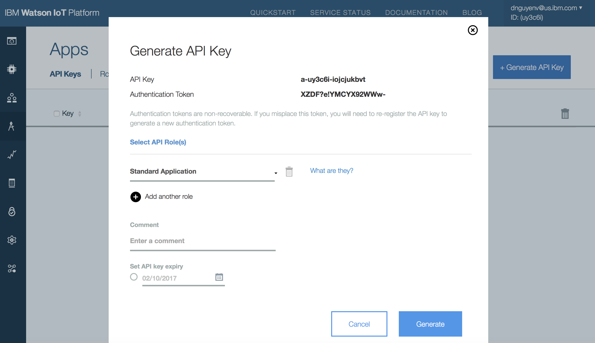

# IBM FAU Hackathon
This is an IoT project named LightUp aiming to introduce to FAU Hackathon event an example as for how to build an IoT application using.
The resulting application is a small mobile web page that allows the user to turn-on and turn-off an electronic device from anywhere using his smartphone.
Here is the architecture overview of the application:



# Stuffs needed for building project
## Hardware:
1. Raspberry Pi 2 / B+.
2. USB wifi dongle
3. USB keyboard and mouse.
4. HDMI monitor and cable.
5. Micro USB power adapter (smartphone charger).
6. PIR motion sensor.
7. Male-female and male-male jumpers.
8. Breadboard.
9. BC547 transistor.
10. 5V SPDT relay and 1n4001 diode.
11. LED and 220Ohm resistor.

## Software:
1. Raspbian OS
2. Python
3. CloudFoundry cli, Bluemix account (go to http://bluemix.net/ to register)

## Circuit wiring up:

Below is the detailed diagram as illustrates how to connect the parts together on the breadboard and with the Pi. Make sure you wire things up before jumping to next steps.


## Basic steps to setup the environment:
1. Setup your Rapberry pi

Follow this quick instruction to quickly install your Pi:

https://www.youtube.com/watch?v=PPvIBH7M32Y

You need a monitor and a keyboard for the first time installation. Make sure you use the wifi dongle provided to connect your Pi to Internet through a wifi access point.

Once you have your Pi setup, you can either use the separate keyboard and monitor to interact with you Pi, or through another machine, like your laptop which is a common way developers use.

If you have a laptop with a lot of tools you're comfortable with, just make sure your Pi and your laptop can connect together(eg: on same network) then you can access and work with your Pi using your laptop through ssh or VNC viewer.

2. Register your Pi to Bluemix

Assuming you have your Pi setup with internet connection using the wifi dongle in step 1.

You can use this recipes to quickly register your Pi to Bluemix using the ibm iotf utility:

https://developer.ibm.com/recipes/tutorials/raspberry-pi-4/

Or you can follow these steps to do that:

Again, make sure you have a Bluemix account (http://bluemix.net/)
Login to Bluemix using your account credentials
Go to Catalog, type "Internet of things" in the Search bar to search for the IBM Internet of Things Foundation service



And create one. Make sure you name it correctly so that the example code can work.



After creating the service, click on Launch dashboard button



to launch the Dashboard screen.



From the dashboard, click on Add a device to add your Raspberry Pi as a new device to the iotf. You need to specify a device type for your device. If you does not have one, create new type, lets name it "RaspberryPi".



Keep selecting "Next" till the creation done. and map your device to that type. Determine an ID for your Pi. You can use its MAC address or name it as your convenience, as long as it's unique within your Bluemix organization.


Keep selecting "Next" till the last screen, where you need to record the important information shown on the screen for later use.


Close the screen, and now your device is added to the list



Next step is to generate an access token for accessing the service, to send and receive information to/from the device. Click on the Access link, then API Keys and Generate API Key button


Remember to record the authentication token displayed for later use since it is one-time shown. You can quickly generate a new one to use as needed.




3. Run your client code

Assuming you've wired things up following the circuit diagram. Login to your Raspberry Pi, then do the following steps to run client component of the project:

Create a directory for your the project, lets name it /opt/fau/iotf

```
sudo mkdir -p /opt/fau/iotf
```
Git has been installed by default with your Raspbian so just use it to clone the code to your Pi:

```
cd /opt/fau/iotf
sudo git clone https://github.com/dnguyenv/iot.git
cd iot
```
Modify your the client.py to match your setting, then save it:

```
######################################################
#Update this section to match your environment setting
######################################################
organization = ""
deviceType = ""
deviceId = ""
authMethod = ""
authToken = ""
```

Install ibmiotf and other necessary libraries for Python on your Raspberry Pi:

```
sudo pip install ibmiotf
```

Now run the app:

```
python client.py
```

4. Deploy your server code to Bluemix

Make sure you have a Bluemix ID upfront.
5. Try it out

More instructions about how to work with Python iotf library can be found here:
https://docs.internetofthings.ibmcloud.com/libraries/python.html
